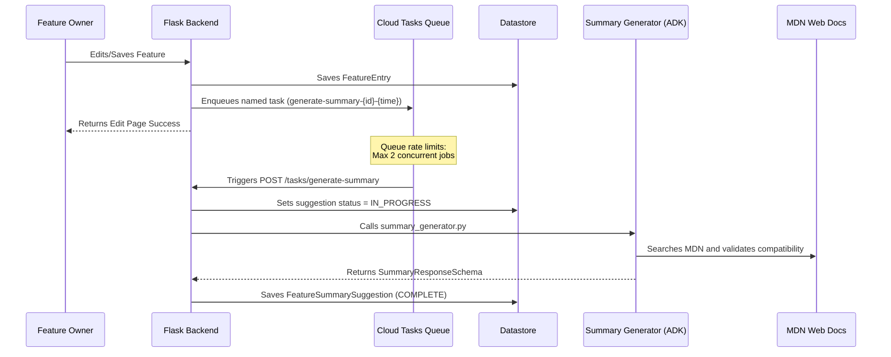

# AI-Assisted Feature Summaries Architecture

This document outlines the architecture, data models, task queues, and robustness logic of the AI summary suggestion engine on ChromeStatus.

---

## 1. Architecture Design

The summary generation flow operates asynchronously using Google App Engine (GAE) and Cloud Tasks to prevent front-end blocking and manage external API rate limits.

---

## 2. Database Models (`internals/core_models.py`)

To avoid schema migration issues on `FeatureEntry`, suggestion data is stored in the decoupled **`FeatureSummarySuggestion`** model.

*   **Key ID**: Identical to the corresponding `FeatureEntry` ID (enabling efficient 1-to-1 lookups without secondary indexes).
*   **Properties**:
    *   `suggested_summary` (`ndb.TextProperty`): AI summary output.
    *   `suggested_doc_links` (`ndb.StringProperty`, repeated): Discovered documentation URLs.
    *   `baseline_status` (`ndb.StringProperty`): Baseline compatibility (`limited`, `newly`, or `widely`).
    *   `status` (`ndb.StringProperty`): Suggestion status enum (`NONE`, `IN_PROGRESS`, `COMPLETE`, `FAILED`).
    *   `status_timestamp` (`ndb.DateTimeProperty`): Timestamp of the last status change.
    *   `last_generation_attempt` (`ndb.DateTimeProperty`): Timestamp when generation was last triggered.
    *   `version` (`ndb.IntegerProperty`): Prompt version used during generation.
    *   `source_fingerprint` (`ndb.StringProperty`): SHA-256 hash fingerprint of the source fields (name, category, summary, spec_link, explainer_links) at the time of generation.

---

## 3. Resilience, Cooldowns & Concurrency

To ensure stability and prevent excessive API quota utilization, several guardrails are built-in:

### Optimistic Concurrency Control (OCC)
Cloud Tasks payloads contain the epoch time of the feature's `updated` field at the time the task was enqueued. When executing, the worker compares this payload time with the current database `FeatureEntry.updated` value. If the database is newer, the task immediately aborts to avoid overwriting newer user changes with stale suggestions.

### Request Debouncing & Cooldowns
Before trigger execution, GAE performs transaction checks on `FeatureSummarySuggestion`:
*   **In Progress Cooldown**: If status is `IN_PROGRESS` and the lock has been held for less than 5 minutes, GAE blocks duplicate worker executions.

### State-Based Source Fingerprinting (Automatic Invalidation)
Rather than using fragile event-based resets in various edit routes, GAE tracks the input state of the feature:
1.  When a generation task starts, it computes an SHA-256 fingerprint hash of all core fields affecting the summary (name, category, summary, spec_link, and explainer_links).
2.  If an existing suggestion is `COMPLETE` or `DISCARDED`, the active prompt version matches `suggestion.version`, **and** the current feature details hash matches `suggestion.source_fingerprint`, GAE immediately skips execution.
3.  **Bypassing Fingerprints (`force=True`)**: If a task is enqueued with the `force` parameter set to `True` (e.g. when an editor clicks "Regenerate Suggestion" on the frontend, or a weekly cron sweeps features to check for external MDN baseline status updates), the fingerprint check is bypassed. GAE will rerun the full agent tools lookup to fetch updated baseline positions.
4.  If any feature details are edited, the fingerprint will differ, and GAE will automatically reset the status to enqueuing a fresh suggestion (allowing a previously discarded suggestion to be regenerated if the user changes the feature's core details).
5.  This saves substantial API generation quota by skipping regenerations for unrelated edits, while allowing discarded suggestions to remain dismissed unless the inputs actually evolve.

---

## 4. Local Development Mock Fallback

To support local testing and offline CI verification (like Playwright integration tests) without leaking or requiring API keys:

*   If `GEMINI_API_KEY` is **not configured** and the app is running in `DEV_MODE` or `UNIT_TEST_MODE`, GAE skips calling the ADK Gemini agent and immediately returns a mock suggestion payload.
*   In production, the backend raises a configuration error and sets the suggestion status to `FAILED`.
