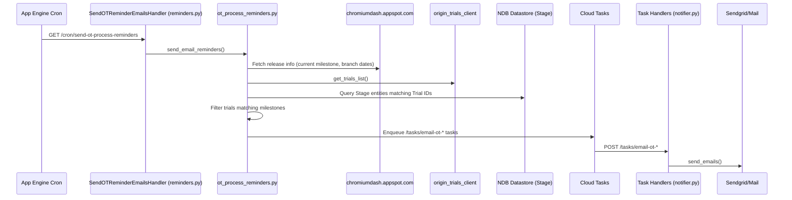

# Origin Trial Process Reminders

This document describes the automated system that sends reminder emails to Origin Trial (OT) contacts about upcoming milestones (e.g., when a trial is branching, entering beta, or ending).

## System Overview

The system runs as a weekly cron job. It identifies active origin trials that match specific milestone criteria based on the current Chrome release schedule (fetched from Chromium Dash), and schedules tasks to send reminder emails to the trial owners and contacts.

## Architecture & Data Flow



## Key Files and Directory Structure

*   **Cron Configuration**:
    *   [cron.yaml](/cron.yaml): Schedules `/cron/send-ot-process-reminders` (currently every Monday at 10:00).
*   **Routing**:
    *   [main.py](/main.py): Routes the cron URL and the task queue URLs (`/tasks/email-ot-*`).
*   **Handlers & Logic**:
    *   [internals/reminders.py](/internals/reminders.py): Contains `SendOTReminderEmailsHandler` (the Flask handler for the cron job).
    *   [internals/ot_process_reminders.py](/internals/ot_process_reminders.py): Core logic for calculating milestones, fetching trials, and enqueuing tasks.
    *   [internals/notifier.py](/internals/notifier.py): Task handlers that render email templates and call `send_emails()`.
*   **Templates**:
    *   [templates/origintrials/](/templates/origintrials/): HTML email templates used by the task handlers.
*   **Tests**:
    *   [internals/ot_process_reminders_test.py](/internals/ot_process_reminders_test.py): Unit tests for the filtering and data building logic in `ot_process_reminders.py`.
    *   [internals/reminders_test.py](/internals/reminders_test.py): Unit tests for the reminder cron handlers in `reminders.py`.
    *   [internals/notifier_test.py](/internals/notifier_test.py): Unit tests for the email rendering and sending handlers in `notifier.py`.

## Core Logic Breakdown (`ot_process_reminders.py`)

The entry point is `send_email_reminders()`. It performs the following steps:

1.  **Determine Milestones**:
    *   Fetches current release data from Chromium Dash.
    *   Calculates `next_branch_release`, `current_stable_release`, and `next_stable_release`.
2.  **Evaluate Timing**:
    *   Checks the number of weeks/days until key dates (e.g., `next_branch_date`, `earliest_beta`).
    *   If a milestone event is happening "this week" (diff is 0 weeks, or 1 week for stable updates), it triggers the corresponding email sends.
3.  **Fetch & Filter Trials**:
    *   `get_trials(release)` fetches all trials from the Origin Trials API.
    *   It filters trials where `start_milestone` or `end_milestone` matches the target `release`.
    *   It loads the corresponding `Stage` entity from NDB Datastore to get contact emails (`ot_owner_email` and `ot_emails`).
4.  **Enqueue Tasks**:
    *   Calls `cloud_tasks_helpers.enqueue_task()` to delegate email sending to Task Queue workers, avoiding timeouts in the cron handler.

## Release Cycle Transition (4-Week to 2-Week)

Starting with milestone 153 (scheduled for September 8th, 2026), Chrome moves from a 4-week release cycle to a 2-week release cycle. This affects how we calculate milestone offsets for reminders to ensure owners receive warnings at similar time intervals (e.g., ~8 weeks notice).

### Dynamic Offset Calculations

To handle this transition, the system dynamically calculates offsets based on the milestone number:

*   **Milestone Offset for Trial End Reminders**:
    In [ot_process_reminders.py](file:///usr/local/google/home/danielrsmith/projects/chromium-dashboard/internals/ot_process_reminders.py), `get_trial_end_release_offset(release)` determines how many milestones ahead we look for trials ending.
    *   `release` <= 151: Offset is **2 milestones** (~8 weeks on 4-week cycle).
    *   `release` == 152: Offset is **3 milestones** (transition to 2-week cycle, target M155 is 8 weeks away).
    *   `release` >= 153: Offset is **4 milestones** (~8 weeks on 2-week cycle).
    
    The helper `get_release_plus_n(release, n)` is used to calculate the target milestone, correctly handling milestone increments.

*   **Future Milestones to Consider for Accuracy Reminders**:
    In [reminders.py](file:///usr/local/google/home/danielrsmith/projects/chromium-dashboard/internals/reminders.py), `FeatureAccuracyHandler` overrides `get_future_milestones_to_consider(current_milestone)` to adjust the lookahead window:
    *   `current_milestone` <= 151: Looks **2 milestones** ahead.
    *   `current_milestone` == 152: Looks **3 milestones** ahead.
    *   `current_milestone` >= 153: Looks **4 milestones** ahead.

This ensures that reminders continue to be sent with approximately 8 weeks of lead time before the relevant milestone event, regardless of the release cycle duration.

## Task to Template Mapping

When `ot_process_reminders.py` enqueues a task, it maps to a handler in `notifier.py` which renders a specific template:

| Task URL | Handler in `notifier.py` | Template in `templates/origintrials/` | Description |
| :--- | :--- | :--- | :--- |
| `/tasks/email-ot-first-branch` | `OTFirstBranchReminderHandler` | `ot-first-branch-email.html` | Sent to contacts when their trial is branching for the first time. |
| `/tasks/email-ot-last-branch` | `OTLastBranchReminderHandler` | `ot-last-branch-email.html` | Sent to contacts when their trial has branched for its last milestone. |
| `/tasks/email-ot-beta-availability` | `OTBetaAvailabilityReminderHandler` | `ot-beta-availability-email.html` | Sent to contacts when their trial is entering beta. |
| `/tasks/email-ot-ending-next-release` | `OTEndingNextReleaseReminderHandler` | `ot-ending-next-release-email.html` | Sent to contacts when their trial is ending in the next release. |
| `/tasks/email-ot-ending-this-release` | `OTEndingThisReleaseReminderHandler` | `ot-ending-this-release-email.html` | (Optional/Draft) Sent when trial ends in current release. |
| `/tasks/email-ot-automated-process` | `OTAutomatedProcessEmailHandler` | `ot-automated-process-email.html` | Summary email sent to the OT admin/support list listing what was processed. |

## How to Make Changes

### 1. Modifying Email Content
To change the wording or layout of a reminder email:
1.  Locate the template in `templates/origintrials/`.
2.  Modify the HTML/Django template syntax.
3.  If you add new variables to the template, update the corresponding handler's `build_email` method in [internals/notifier.py](/internals/notifier.py) to pass them in `body_data`.
4.  Update the tests in [internals/notifier_test.py](/internals/notifier_test.py) (you may need to update the golden files if the test asserts on exact HTML structure).

### 2. Adding a New Reminder Type
To add a new type of reminder (e.g., 2 weeks before ending):
1.  **Define Task Route**: Add the new task route to `internals_routes` in [main.py](/main.py).
2.  **Implement Handler**: Create a new handler class in [internals/notifier.py](/internals/notifier.py) (e.g., `OTNearEndReminderHandler`). Specify `EMAIL_TEMPLATE_PATH` and implement `process_post_data` and `build_email`.
3.  **Create Template**: Add the HTML template under `templates/origintrials/`.
4.  **Update Core Logic**: In [internals/ot_process_reminders.py](/internals/ot_process_reminders.py):
    *   Calculate the time difference that should trigger this reminder.
    *   Call `cloud_tasks_helpers.enqueue_task('/tasks/email-ot-your-new-task', params)` when the criteria are met.
5.  **Add Tests**:
    *   Add unit tests in [internals/ot_process_reminders_test.py](/internals/ot_process_reminders_test.py) to verify the logic triggers the enqueue call under correct milestone conditions.
    *   Add unit tests in [internals/notifier_test.py](/internals/notifier_test.py) to verify the handler correctly renders and sends the email.

## Running Tests

You can run all backend tests locally using the standard test command:

```bash
# Run all Python tests (including reminders tests)
npm test
```

If you want to run only specific test files to save time, you must manually run `pytest` within the virtual environment while the Datastore emulator is running:

```bash
# 1. Start the Datastore emulator in one terminal (keeps running)
make start-emulator

# 2. In another terminal, run pytest for the specific files
. cs-env/bin/activate
pytest internals/ot_process_reminders_test.py
pytest internals/reminders_test.py
pytest internals/notifier_test.py

# 3. Stop the emulator when done
make stop-emulator
```

